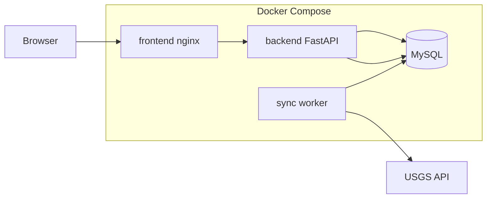

# Erdbeben-Auswertungsanwendung – Implementierungsplan

## Ausgangslage

- Workspace [`C:\__DATA__\CURSOR_PROJECTS\earthquake`](C:\__DATA__\CURSOR_PROJECTS\earthquake) ist **leer** (Greenfield).
- Datenquelle: [USGS FDSN Event Web Service](https://earthquake.usgs.gov/fdsnws/event/1/) – wie im Konzeptskript `format=text`, alternativ **`format=geojson`** im Backend (einfacher zu parsen, gleiche Filter).
- API-Limit: **max. 20.000 Events pro Request** → historischer Backfill muss in Zeitfenstern chunken.

## Architektur (Zielbild)



| Service | Technologie | Rolle |
|---------|-------------|-------|
| `db` | MySQL 8 | Persistenz |
| `backend` | Python 3.12 + FastAPI | REST-API, Auth, Abfragen |
| `sync` | Python (gleiches Image) | Historischer Backfill + periodischer Sync |
| `frontend` | React 18 + Vite + nginx | GUI: Filter, Tabelle, Karte, Heatmap, i18n |

**Entscheidungen aus Klärung:** React+Vite, Compose, einfacher Admin-Login (Env), Region = Karten-BBox + Textsuche + Presets, DE+EN, Backfill + laufender Sync.

---

## Projektstruktur

```
earthquake/
├── .cursor/rules/          # angepasst aus ownly
├── backend/
│   ├── app/
│   │   ├── main.py
│   │   ├── auth/
│   │   ├── api/v1/         # earthquakes, sync, health
│   │   ├── models/
│   │   ├── schemas/
│   │   ├── services/       # usgs_client, sync, query
│   │   └── db/
│   ├── alembic/
│   ├── tests/
│   ├── Dockerfile
│   └── requirements.txt
├── frontend/
│   ├── src/
│   │   ├── api/
│   │   ├── components/     # FilterBar, EarthquakeTable, MapView, HeatmapLayer
│   │   ├── i18n/           # de.json, en.json
│   │   └── pages/
│   ├── Dockerfile
│   └── package.json
├── docker-compose.yml
├── .env.example
├── scripts/
│   ├── init-env.sh
│   └── compose-dev-down.sh
└── README.md
```

---

## Backend (Python / FastAPI)

### Datenmodell (MySQL)

Kern-Tabelle `earthquakes` (USGS-Felder aus Text/GeoJSON):

- `event_id` (PK, USGS EventID)
- `time_utc`, `latitude`, `longitude`, `depth_km`
- `magnitude`, `mag_type`
- `location_name`, `author`, `catalog`, `contributor`
- `updated_at` (USGS-Update-Zeit für inkrementellen Sync)
- `fetched_at` (Import-Zeitpunkt)

Metadaten-Tabelle `sync_state`:

- `key` (z.B. `backfill`, `incremental`)
- `last_success_at`, `last_updatedafter`, `status`, `message`

Indizes: `(time_utc)`, `(magnitude)`, `(latitude, longitude)`, `(location_name)` – für Filter und Kartenabfragen.

Migrationen via **Alembic** (Regel analog zu ownly: angewandte Migrationen nicht nachträglich editieren).

### USGS-Import

**Historischer Backfill** (beim ersten Start / manuell triggerbar):

1. Start ab konfigurierbarem Datum (Default: `2010-01-01`, Env `USGS_BACKFILL_START`).
2. Monatsweise (oder wöchentlich bei dichten Regionen) Requests mit `format=geojson`, `limit=20000`.
3. Bei 20.000 Treffern: Fenster verkleinern (z.B. Woche/Tag) und retry.
4. Upsert nach `event_id` (idempotent).

**Laufender Sync** (Container `sync`, z.B. alle 15 Min.):

- `updatedafter=<last_success>` aus `sync_state`.
- Upsert neuer/geänderter Events.
- Fehler in `sync_state.message` + strukturiertes Logging.

Client: `httpx` mit Timeout, Retry bei 429/5xx, Rate-Limit-respektierend.

### REST-API (`/api/v1`)

| Endpoint | Zweck |
|----------|-------|
| `POST /auth/login` | Admin-Login → JWT (Credentials aus Env) |
| `GET /earthquakes` | Gefilterte Liste (Pagination) |
| `GET /earthquakes/map` | Leichtgewichtige GeoJSON/Points für Karte/Heatmap |
| `GET /earthquakes/stats` | Aggregat (Anzahl, max Mag, Zeitraum) |
| `GET /sync/status` | Backfill-/Sync-Status |
| `POST /sync/trigger` | Manueller Sync (Admin) |
| `GET /health` | DB + Sync-Health |

**Filter-Parameter** (spiegeln USGS + GUI):

- `start_date`, `end_date`
- `min_magnitude`, `max_magnitude`
- `min_depth`, `max_depth`
- `min_lat`, `max_lat`, `min_lon`, `max_lon` (BBox)
- `location_query` (LIKE auf `location_name`)
- `region_preset` (vordefinierte BBoxes: `europe`, `pacific_ring`, `global`, …)
- `limit`, `offset`, `sort`

**Fehlerformat** (adaptiert aus [ownly `api-error-shape.mdc`](https://github.com/AsP3X/ownly/blob/master/.cursor/rules/api-error-shape.mdc)):

```json
{ "error": { "code": "VALIDATION_ERROR", "message": "..." } }
```

Logging intern detailliert; HTTP-Body ohne Secrets/SQL.

### Auth

- Ein Admin-User: `ADMIN_USERNAME` + `ADMIN_PASSWORD_HASH` (bcrypt) in `.env`.
- JWT (HttpOnly-Cookie oder Bearer – Frontend: Bearer in `Authorization`).
- Alle Auswertungs-Endpunkte geschützt; `/health` öffentlich.

---

## Frontend (React + Vite)

### Seiten / Layout

- **Login** – einfaches Formular
- **Dashboard** – Filterleiste + drei Ansichten (Tabs oder Split-Layout):
  1. **Tabelle** – TanStack Table, sortierbar, paginiert, Spalten: Zeit, Ort, Mag, Tiefe, Koordinaten
  2. **Weltkarte** – **MapLibre GL JS** (oder Leaflet) mit Cluster-Markern, Pan/Zoom/Wheel/Touch
  3. **Heatmap** – Density-Layer auf derselben Karte (Toggle Map/Heatmap)

### Filter-UX

- Datumsbereich (DatePicker)
- Magnitude/Tiefe (Range-Slider)
- **Region Preset** (Dropdown)
- **Textsuche** Ort
- **BBox auf Karte** – Rechteck zeichnen (MapLibre Draw / Leaflet.draw); BBox synchronisiert mit API-Query
- Filter-State in URL-Query (shareable/bookmarkable)

### i18n

- `react-i18next` mit `de` + `en`
- Sprachumschalter in Header; Datums-/Zahlenformat locale-aware

### API-Client

- `frontend/src/api/client.ts` – zentraler Fetch-Wrapper, parst `error.message`/`error.code` (ownly-Konvention)

---

## Docker Compose

[`docker-compose.yml`](docker-compose.yml) – **eine** Compose-Datei (Regel aus ownly: keine extra Varianten ohne explizite Anfrage):

| Service | Ports | Notes |
|---------|-------|-------|
| `db` | 3306 (intern) | Named volume `mysql_data` |
| `backend` | 8000 | wartet auf DB-Migration |
| `sync` | – | gleiches Image, CMD `python -m app.services.sync_worker` |
| `frontend` | 8080 → nginx:80 | Proxy `/api` → backend |

- `.env.example` mit allen Variablen; `scripts/init-env.sh` kopiert nach `.env`
- **`scripts/compose-dev-down.sh`** ohne `-v` (Datenschutz-Regel aus ownly)
- Frontend-Lockfile: Alpine-`npm install` vor Commit ([`frontend-npm-lockfile-docker.mdc`](https://github.com/AsP3X/ownly/blob/master/.cursor/rules/frontend-npm-lockfile-docker.mdc))

---

## Cursor-Regeln (adaptiert aus ownly)

Quelle: [AsP3X/ownly/.cursor/rules](https://github.com/AsP3X/ownly/tree/master/.cursor/rules)

| ownly-Regel | Aktion für earthquake |
|-------------|----------------------|
| `agent.mdc` | Übernehmen; Nebular-OS-Zeile entfernen; Pfade auf `backend/`/`frontend/` |
| `data-safety.mdc` | Fast unverändert (MySQL statt Postgres erwähnen) |
| `docker-compose-safety.mdc` | MySQL-Volume statt Postgres; Compose-Services anpassen |
| `git-commits.mdc` | TASK/FIX-Format behalten; Branch-Modell optional vereinfachen (`main`/`dev`) |
| `api-error-shape.mdc` | FastAPI + `frontend/src/api/client.ts` statt Rust/Axum |
| `frontend-npm-lockfile-docker.mdc` | Pfade beibehalten |
| `plan-execution.mdc` | Testbefehle: `pytest`, `npm run build` |
| `regression-testing.mdc` | `pytest`, `npm run lint/build`; Smoke: Login, Filter, Karte |
| `inline-documentation.mdc` | Globs erweitern: `**/*.{py,ts,tsx}` |
| `api-sqlx-migrations.mdc` | **Neu:** `api-alembic-migrations.mdc` für Alembic |
| `nebular-os-vendor.mdc`, `rust/*`, `audit-log-coverage.mdc` | **Nicht übernehmen** (ownly-spezifisch) |

---

## Wichtige technische Details

### USGS Textformat (Referenz)

Spalten aus Konzeptskript:

`EventID|Time|Latitude|Longitude|Depth/km|Author|Catalog|Contributor|ContributorID|MagType|Magnitude|MagAuthor|EventLocationName`

Backend nutzt **GeoJSON** intern; Textformat bleibt als dokumentierte Alternative.

### Karten-Bedienkonzept

- Scroll-to-zoom, Drag-to-pan, Pinch auf Touch
- Zoom-Controls (+/−), „Fit to results“-Button
- Marker-Cluster bei vielen Punkten; Heatmap-Intensität nach Magnitude gewichtet
- Popup bei Klick: Zeit, Ort, Mag, Tiefe

### Tests & Qualität

- Backend: `pytest` (API-Filter, USGS-Parser-Mock, Auth)
- Frontend: `npm run build`, `npm run lint`
- Manueller Smoke: Login → Filter setzen → Tabelle/Karte/Heatmap konsistent

---

## Implementierungsreihenfolge

1. **Scaffold** – Ordnerstruktur, `.gitignore`, `.env.example`, README
2. **Cursor-Regeln** – `.cursor/rules/` anlegen (adaptiert)
3. **DB + Backend-Kern** – Modelle, Alembic, FastAPI-Skeleton, Error-Envelope
4. **USGS Sync** – Client, Backfill-Worker, Incremental-Worker, `sync_state`
5. **Query-API** – Filter, Pagination, Map-Endpoint
6. **Auth** – Login + JWT-Middleware
7. **Frontend-Basis** – Vite/React, i18n, Login, API-Client
8. **Auswertungs-UI** – Filter, Tabelle, Karte, Heatmap, BBox-Draw
9. **Docker Compose** – alle Services, Healthchecks, Volumes
10. **Dokumentation + Smoke-Tests** – README mit `docker compose up`, erste Nutzung

---

## Offene Detailentscheidungen (mit sinnvollen Defaults)

Diese Punkte blockieren nicht den Start; Defaults werden gesetzt, können später angepasst werden:

| Thema | Default |
|-------|---------|
| Backfill-Startdatum | `2010-01-01` (Env überschreibbar) |
| Sync-Intervall | 15 Minuten |
| Min. Magnitude beim Import | `-1` (alle Events; Filter nur in GUI) |
| JWT-Laufzeit | 8 Stunden |
| Map-Tiles | OpenStreetMap / MapLibre Demo (kein API-Key nötig) |
